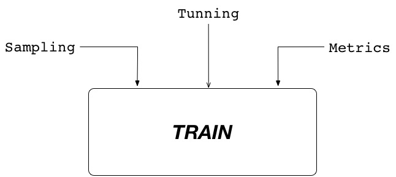
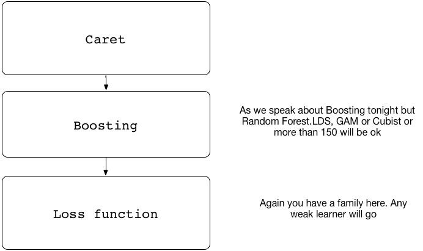
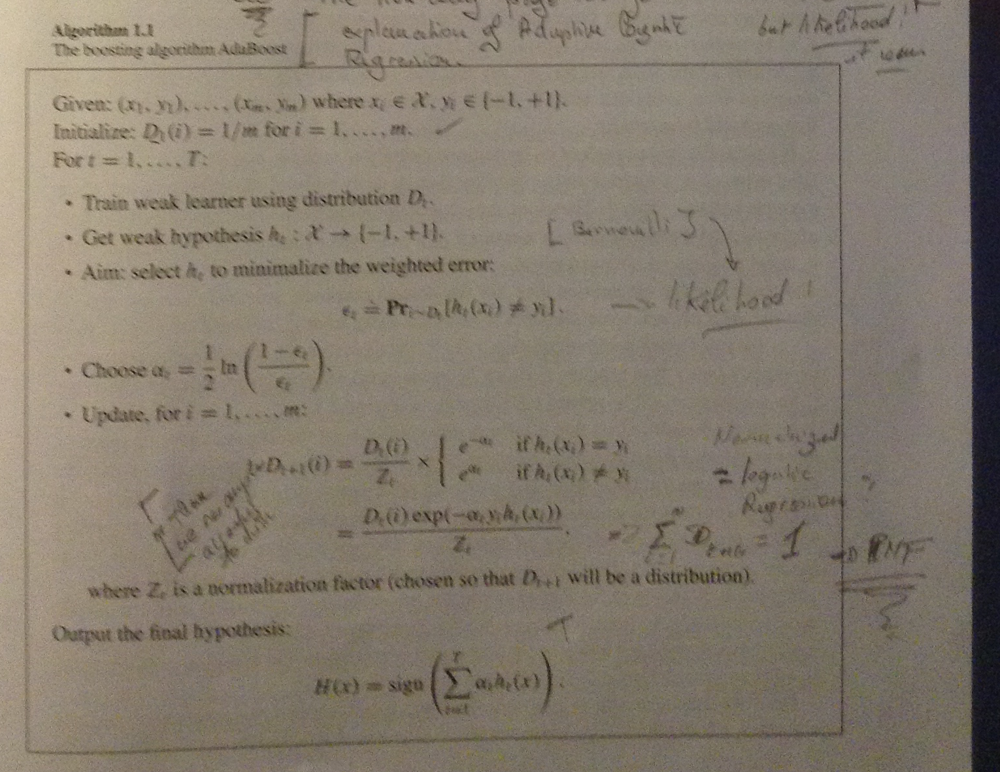
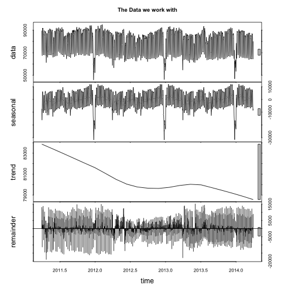
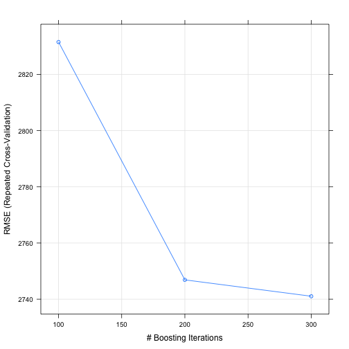

Caret - Boosting
========================================================
author: Alain Lesaffre
date:   28th May 2014

# __1st Perth R Meetup__ 

========================================================

__Caret leverages the abitily to work with multiples models using similar interfaces. At writing time there are about 140 models integrated in Caret.__ 

__What about Caret??__



The core of Caret is the train() function and the one you have to focus one. But the great advantage of Caret train() is that it will select the best model out of all the models you submit. 


How does Caret fit? 
========================================================

Caret allows validation and optimization of models. Tonight we shall explore the following. 



__It starts to be pretty crownd here !!!__ 


Boosting
========================================================

One of the most surprising and used Machine Learning Ensemble method at the moment. Quick review what does this wonderful "frame" does ? 

It plays with probability. 
 


Back to Caret 
========================================================
Three type of parameters to keep in mind 

1. The Sampling: K fold, Repeats, Bootstrap. __By default Caret will use Bootsrap  with 25 repeats__

2. The paramaters for the loss function in case of Boosting: Tree & Complexity , Random Forest & Number of variables, Regression & Iterations.

3. The metrics:  Kappa, Accuracy what Caret is using by defaults for Class and RMSE for regression 

Time to put all this in practice 
========================================================

We shall use a subset of the following Data Set. The initial objective was to build a forecasting solution and final solution was made of 12 models. Tonight we work with one week day Monday.



We use Boosting with one day data. 

Boosting - Data preparation 
========================================================

The test and training set is built using createDataPartition(). Caret performs __random stratified sampling__.  


```r
trainingindex  <-createDataPartition(mondaydata $volume, p=.7, time=1, list=FALSE)
trainingset <-mondaydata[c(trainingindex),]
testset     <-mondaydata[-c(trainingindex),]
head(trainingset[,1:5], 2)
```

```
      Date   volume winter Solar_Rad      Temp
1  4-04-11 90183.71      0  282.9167  7.492708
2 11-04-11 86561.87      0  506.4583 10.477083
```

Boosting - One method 
========================================================

Boosting is driven by the loss function to build the learners' weights. For this example we use Gradient Boosting with __Tree__  from the mboost package. 

1. Which Parameters could we play with ? 
   
   a. Caret filter some parameters of the original method glmBoost. We have only two parameters: number of trees & pruning. 
   
2. Which sampling do we want? By default Caret does bootstraping with 25 repeats. We shall use both default and 10 K-folds   

Boosting without Caret 
========================================================

Without Caret, the boosting function is set to 100 iterations, as shown here. 

```r
niterations <- c(100)
firstmodel <-glmboost(volume~winter+Solar_Rad+Temp+month+year+school_holiday, data = trainingset,
                                 control = boost_control(mstop = niterations ))  ## Parameter for boosting 
firstpredict <-predict(firstmodel, newdata = testset)
firstRMSE <-RMSE(firstpredict, testset$volume)
```
Error (MAPE) is:  ``0.0332745`` % with 100 iterations. 

Boosting & Caret - 
========================================================

In previous slide, we build a first model with 100 iterations. 
Caret offers the possibility to run multiple models and pick up the best one. 

```r
glmboostparam <-expand.grid(mstop = c(100,200,300), prune=TRUE)
firstcaretmodel <-train(volume~winter+Solar_Rad+Temp+month+year+school_holiday,
                    data=trainingset,
                    method="glmboost",
                    tuneGrid =glmboostparam
                    )
```

Boosting & Caret - What heppened?
========================================================
The following table shows the metrics for each iterations and model.  
The final RMSE is of ``2698.1234261``


|     RMSE|   Rsquare|
|--------:|---------:|
| 2654.153| 0.5681648|
| 3424.890| 0.6317352|
| 2717.151| 0.6228778|
| 3003.339| 0.5392249|
| 3245.493| 0.5674047|
__NOTES:__ The final model that is the one with the best metrics is in $finalModel and its class is : ``glmboost, mboost`` whereas as the firstcaretmodel object is of class __train__ 

Boosting & Caret - Reduction of the Bias
========================================================

Caret allows to build multiple models with repeats of K-fold and to adjust the number of iterations. We take ten folds and repeat 3 times as example.  
The trainControl() function is used to build the table used by train(). 


```r
boostcontrol <- trainControl( method = "repeatedcv",number = 10,repeats = 3)
secondcaretmodel <-train(volume~winter+Solar_Rad+Temp+month+year+school_holiday,data=trainingset,
                    method    ="glmboost",
                    tuneGrid  = glmboostparam,
                    trControl = boostcontrol
                    )
```


Boosting & Caret -Results 
========================================================

The RMSE of the K folds model is :  ``2698.1234261`` 

The errors are: 

1. For simple model   ``3.3274508`` %

2. For K fold model   ``3.1735741`` %


Boosting & Caret - Plot
========================================================
Caret own plot function allows you to explore the adjustment of your model. 
The plot below shows the RMSE for the three models using 10 K-Folds.



Quick Summary
========================================================

The main function train() allows access to 140 models with similar interfaces for all models. 

1. It allows easy selection of the parameters. 

2. It facilitates the choice of model.  

__But it does pick up the best model with what you give__ It allows to explore faster, but does not do the fine tuning, validation. 

If any questions about Caret, Bossting or other models bring them to the next Perth R Group Meeting or send me a mail 

Alain


